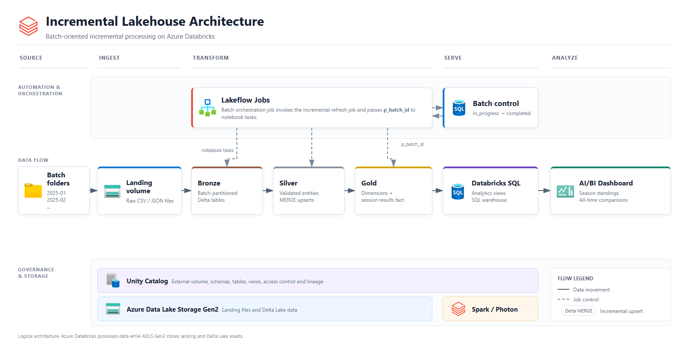
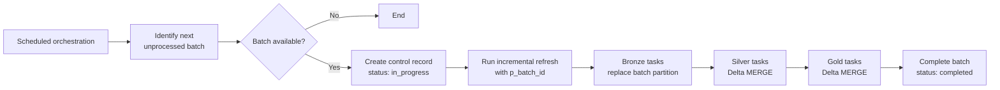
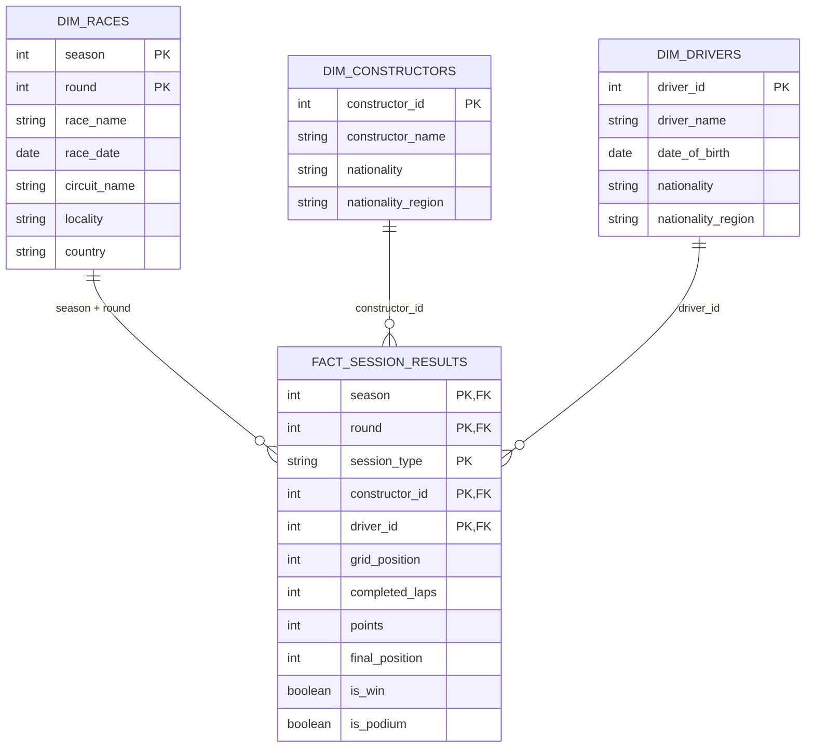
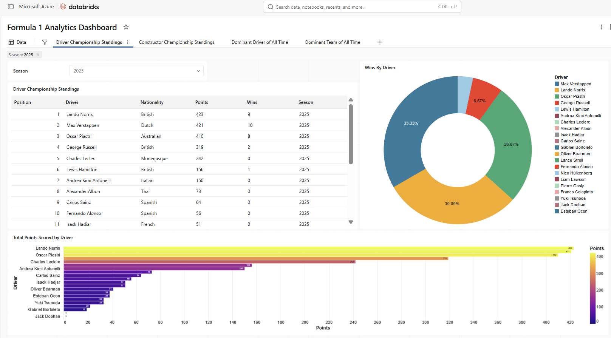
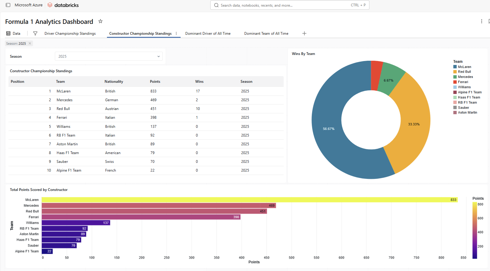
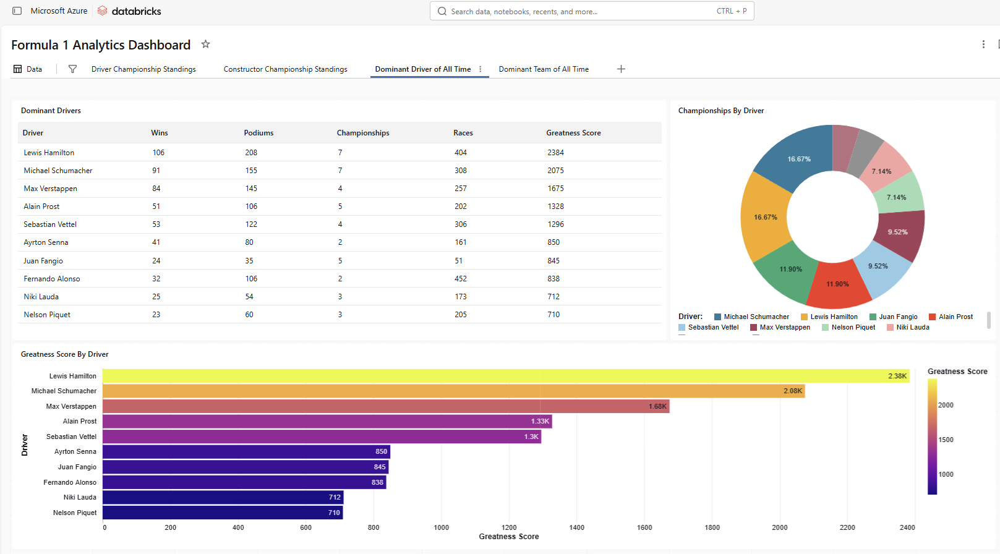
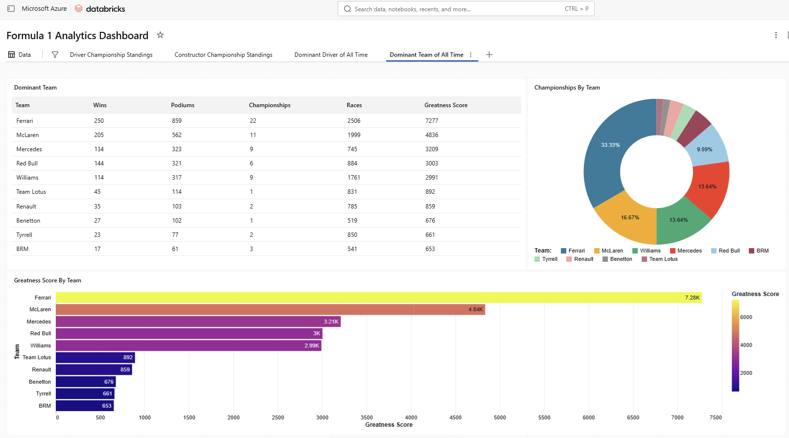

# Azure Databricks Incremental Lakehouse Pipeline & Analytics Dashboard

This project implements a batch-oriented incremental lakehouse pipeline on Azure Databricks. It processes motorsport race data through Bronze, Silver, and Gold layers, coordinates each batch with Lakeflow Jobs, publishes driver and constructor standings as SQL views, and presents the analytical model through an AI/BI dashboard.

The repository keeps one production notebook per Lakeflow task, with shared write logic separated into reusable helper notebooks.

## Architecture

The architecture separates the primary data path from the capabilities that
operate across it. Lakeflow Jobs coordinates each batch, Unity Catalog governs
the data assets, ADLS Gen2 stores the landing files and Delta tables, and
Databricks SQL serves the analytical model to the AI/BI dashboard.

## Incremental Batch Workflow

The Bronze, Silver, and Gold sections contain parallel entity-level tasks where
their Lakeflow dependencies allow it. The orchestration job advances to the
next folder only after the current batch is recorded as completed.

## Gold Analytical Model

The Gold layer uses a dimensional model with one session-results fact and three
dimensions. Driver and constructor standings views aggregate this model for the
dashboard.

## What This Project Demonstrates

- Azure Data Lake Storage access through a Unity Catalog external location and external volume
- Incremental ingestion controlled by a `p_batch_id` job parameter
- Idempotent Bronze writes with Delta partition replacement
- Silver and Gold upserts with Delta Lake `MERGE`
- Medallion architecture using Unity Catalog schemas
- Lakeflow Jobs task dependencies and nested job execution
- Control-table-based batch discovery and status tracking
- SQL analytics views built from a dimensional Gold model
- AI/BI dashboard pages for season standings and all-time performance

## Repository Layout

| Path | Purpose |
| --- | --- |
| `notebooks/00-common` | Shared configuration and Bronze, Silver, and Gold write helpers |
| `notebooks/01-setup` | Unity Catalog, schemas, external location, and volume setup |
| `notebooks/02-bronze` | Six raw-file ingestion tasks |
| `notebooks/03-silver` | Six cleansing and entity upsert tasks |
| `notebooks/04-gold` | Dimensions, nationality reference, and session-results fact |
| `notebooks/05-analytics` | Season standings views and all-time driver and constructor analyses |
| `notebooks/06-orchestration` | Batch control table and orchestration tasks |
| `docs/diagrams` | High-level architecture diagrams |
| `docs/Screenshots/Lakeflow_Jobs` | Lakeflow Jobs run graphs |
| `docs/Screenshots/Dashboard` | AI/BI dashboard screenshots |
| `docs/project-guide.md` | Detailed execution order, runtime objects, and Lakeflow task mapping |
| `data/data-usage-guide.md` | Landing data layout and how batches are used by the pipeline |

## Pipeline Layers

**Bronze:** Reads the files for one batch folder, adds source metadata and `batch_id`, then replaces only that batch partition.

**Silver:** Filters the selected Bronze batch, standardizes schemas and values, removes invalid or duplicate records, and merges the latest batch into entity tables.

**Gold:** Builds race, constructor, and driver dimensions plus a unified `fact_session_results` table for race and sprint sessions.

**Analytics:** Creates ranked season standings views and aggregates them into all-time driver and constructor comparisons.

**Dashboard:** Presents season standings, championship comparisons, and all-time driver and constructor performance from the analytical model.

## Running the Project

1. Connect this repository to a Databricks Git folder.
2. Confirm the storage account, container, and storage credential in `notebooks/01-setup/01.Setup Project Environment.sql`.
3. Run the setup notebook and `notebooks/06-orchestration/00.Create Control Tables.py` once.
4. Upload the batch folders described in `data/data-usage-guide.md` to the landing volume.
5. Configure the incremental refresh Lakeflow Job with the notebook tasks and dependencies listed in `docs/project-guide.md`.
6. Configure the orchestration Lakeflow Job and schedule it as required.
7. Run the analytics notebooks after the Gold tables are available.
8. Build the AI/BI dashboard from the standings views and Gold tables described in `docs/project-guide.md`.

These source-format notebooks are designed to execute in Azure Databricks. GitHub displays and versions the code, documentation, and screenshots, but it does not execute the Databricks pipeline.

## Lakeflow Job Orchestration

### Incremental Refresh Job

### Batch Orchestration Job

## AI/BI Dashboard

The dashboard is organized into four analytical pages:

| Page | Focus |
| --- | --- |
| Driver Championship Standings | Driver rank, points, wins, and podiums for a selected season |
| Constructor Championship Standings | Constructor rank, points, wins, and podiums for a selected season |
| Dominant Drivers of All Time | Career performance comparisons across seasons |
| Dominant Teams of All Time | Constructor performance comparisons across seasons |

The all-time pages use a project-defined `greatness_score` to provide a simple
comparison across championship winners:

`championships * 100 + wins * 10 + podiums * 3`

This score is an analytical feature of the project rather than an official
championship ranking.

### Driver Championship Standings

### Constructor Championship Standings

### Dominant Drivers of All Time

### Dominant Teams of All Time

