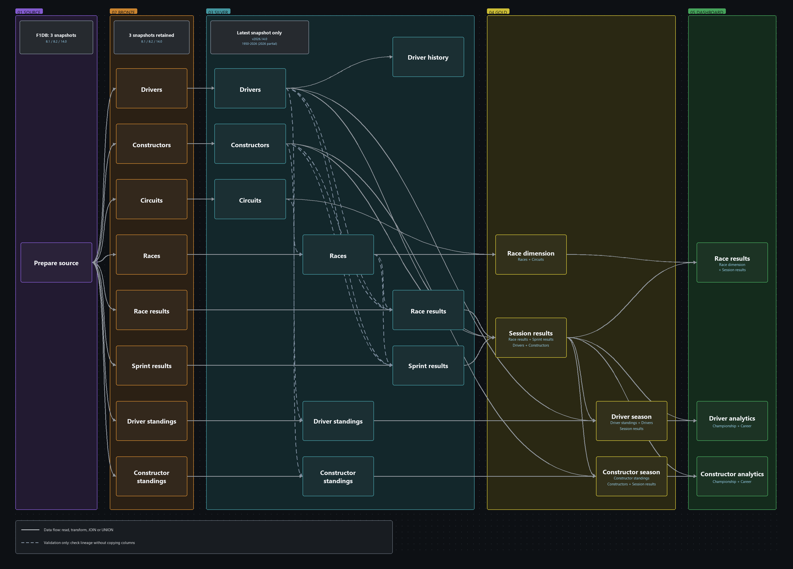
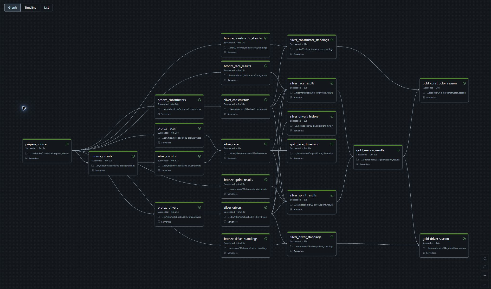
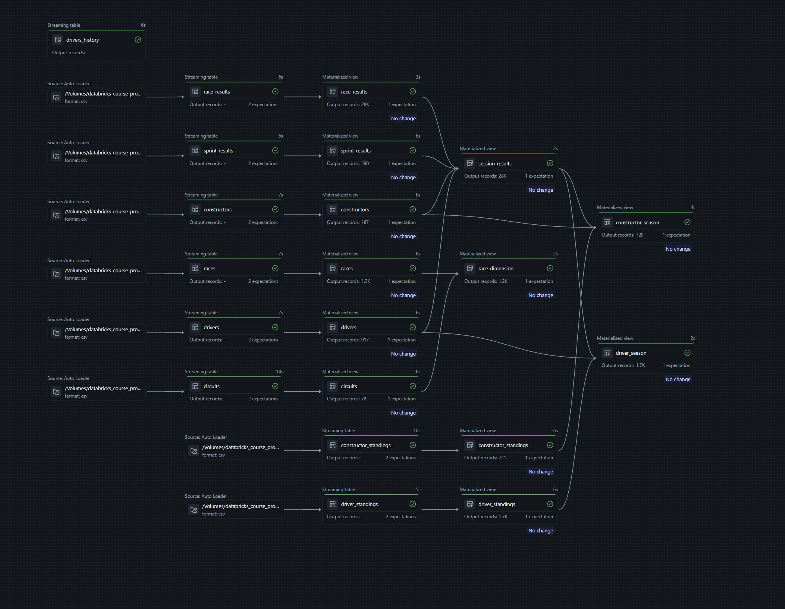
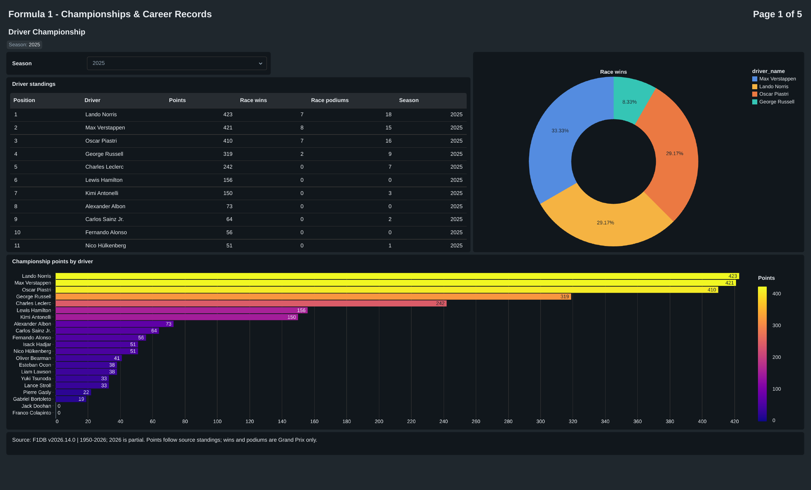
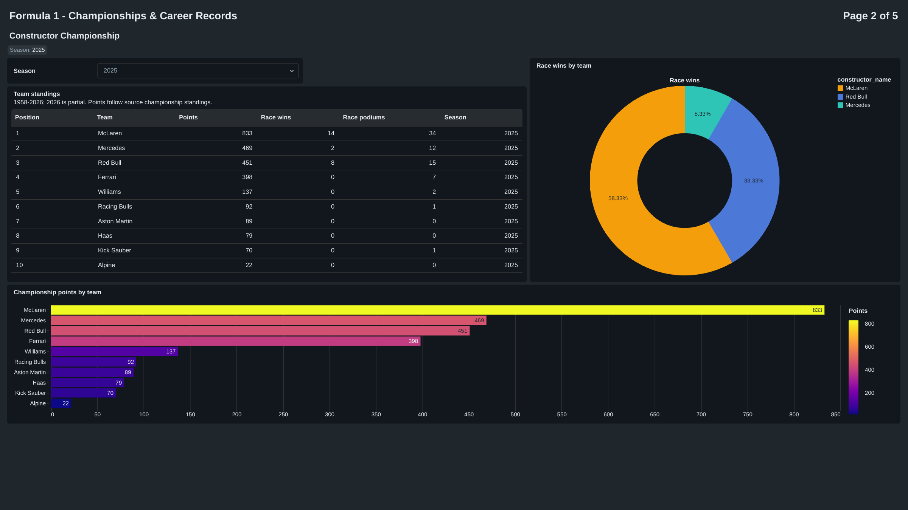
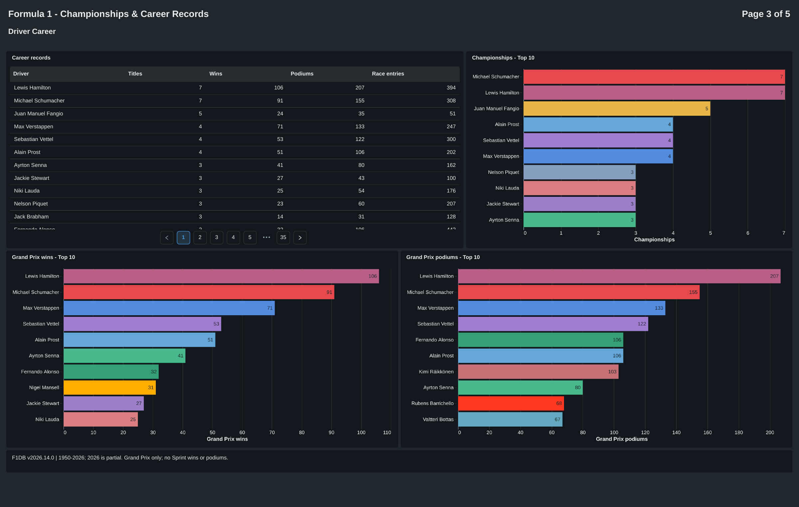
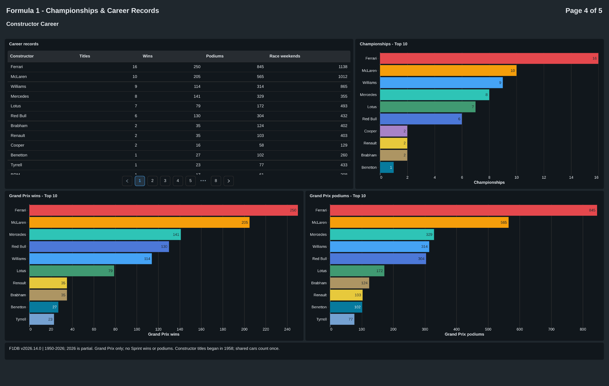
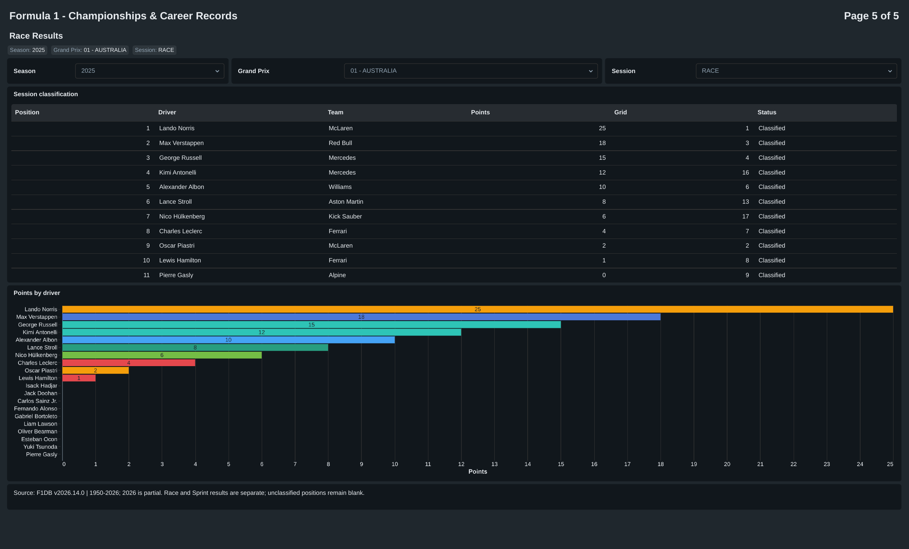

# Formula 1 Data Pipeline & Analytics on Azure Databricks

This project builds a production-style data pipeline and analytics solution on Azure Databricks using pinned releases from the open-source [F1DB](https://github.com/f1db/f1db) dataset. Three source snapshots are processed through Bronze, Silver, and Gold layers before the curated data is presented in a five-page AI/BI dashboard.

The same transformation logic is implemented in two ways. The **Manual Pipeline** uses explicit notebooks, Auto Loader, Structured Streaming, Delta `MERGE`, and hand-built SCD Type 2 logic. The **Lakeflow Spark Declarative Pipeline (SDP)** expresses the equivalent datasets with streaming tables, materialized views, expectations, and `AUTO CDC FROM SNAPSHOT`.

## Architecture

The architecture keeps the two implementations isolated while giving them the same source snapshots and analytical target. Bronze retains all three pinned releases, the current Silver and Gold tables represent the latest configured snapshot, and a separate driver-history table preserves changes across releases. The AI/BI dashboard reads the verified Manual Gold outputs; the SDP implementation is validated against those outputs rather than powering a duplicate dashboard.

## Key Capabilities

- Three ordered F1DB snapshots with pinned release tags and archive checksums
- Auto Loader ingestion with Structured Streaming, checkpoints, and `availableNow` processing
- Eight append-only Bronze tables and eight current-state Silver tables
- Delta `MERGE` for idempotent current-state processing and correction handling
- Driver history using SCD Type 2 across ordered source snapshots
- Four analysis-ready Gold tables at race, session, driver-season, and constructor-season grains
- Two equivalent implementations: a 22-task Manual Job and a managed SDP data pipeline
- A five-page AI/BI dashboard backed directly by four Manual Gold tables
- Local tests plus cloud row-level parity checks between Manual and SDP outputs

## Pipeline Design

### Layer Overview

| Stage | Purpose | Processing behavior |
| --- | --- | --- |
| Source | Download three pinned public F1DB releases | Verify each archive and prepare its eight CSV datasets |
| Bronze | Preserve imported source rows and ingestion metadata | Append each snapshot with its release version |
| Silver | Standardize, type, deduplicate, and validate current entities | Select the active snapshot and upsert current records with Delta `MERGE` |
| Silver history | Preserve changes to driver identity attributes | Apply SCD Type 2 across the ordered snapshots |
| Gold | Join related Silver entities and build analytical datasets | Produce four tables with explicit analytical grains |
| Dashboard | Present championship, career, and race-result analysis | Query Manual Gold through seven saved SQL datasets |

### Two Implementations

| Implementation | Databricks structure | Main techniques |
| --- | --- | --- |
| Manual Pipeline | One Lakeflow Job with 22 notebook tasks | Auto Loader, `writeStream`, checkpoints, Delta `MERGE`, explicit checks, and hand-built SCD2 |
| Declarative Pipeline | One managed SDP pipeline with 21 dataset notebooks, launched by a three-task Job | Streaming tables, materialized views, expectations, and `AUTO CDC FROM SNAPSHOT` |

Both implementations use separate Unity Catalog schemas, volumes, checkpoints, and deployment roots. This avoids cross-writing while allowing their eight current Silver and four Gold tables to be compared in both directions.

### Gold Analytical Model

| Gold table | Grain | Built from | Purpose |
| --- | --- | --- | --- |
| `race_dimension` | Race | Races + circuits | Season, round, date, race, and circuit context |
| `session_results` | Race/session/driver/car | Race and Sprint results + races + drivers + constructors | Classifications, points, wins, podiums, and participant identities |
| `driver_season` | Season/driver | Driver standings + drivers + session results | Championship standing and calculated season performance |
| `constructor_season` | Season/constructor/engine | Constructor standings + constructors + session results | Engine-aware team standing and season performance |

The Gold layer contains the reusable analytical outputs. It does not add copied dimensions, separate reporting tables, or validation-only publication stages.

## Manual Lakeflow Job

The Manual Pipeline keeps one notebook per visible task so the Databricks Job graph shows where each source table is ingested, transformed, and joined. Dependencies represent real execution or data-quality requirements rather than layout-only connections.

The 22 tasks cover source preparation, eight Bronze tables, eight current Silver tables, driver history, and four Gold outputs. Each run is on demand and processes the configured release without continuous compute.

## Lakeflow Spark Declarative Pipeline

The SDP version models the same datasets declaratively. Databricks owns dataset dependency ordering and incremental state inside the pipeline, while a small surrounding Job prepares the pinned source, starts the pipeline, and records the completed release.

Its lineage contains eight Bronze streaming tables, eight current Silver materialized views, one driver-history table, and four Gold materialized views. It intentionally does not connect to a second dashboard because its current Silver and Gold rows have already been validated against the Manual implementation.

## AI/BI Dashboard

The dashboard is organized into five focused pages. Seven saved SQL datasets query the four Manual Gold tables directly, so no additional reporting tables or Dashboard-specific Job tasks are required.

| Page | Focus |
| --- | --- |
| Driver Championship | Season rank, points, wins, podiums, and trend for each driver |
| Constructor Championship | Season rank, points, wins, podiums, and trend for each constructor |
| Driver Career | Career titles, wins, podiums, entries, and season history |
| Constructor Career | Historical team titles, wins, podiums, entries, and season history |
| Race Results | Race and Sprint classifications with race and circuit context |

Career comparisons use direct, explainable measures rather than a project-defined composite score.

### Driver Championship

### Constructor Championship

### Driver Career

### Constructor Career

### Race Results

## Verification

- The Manual Pipeline completed all 22 tasks for the active `v2026.14.0` snapshot.
- SDP processed all three snapshots and repeated the latest snapshot without creating duplicate current rows.
- Eight current Silver tables and four Gold tables matched the Manual outputs in both directions.
- Driver history contains 1,147 versions representing 917 current drivers across the three releases.
- Gold outputs contain 1,172 races, 28,189 session results, 1,681 driver seasons, and 720 constructor-engine seasons.
- The repository has 47 passing local tests covering source configuration, transformations, history, SDP definitions, and Dashboard assets.

The checks establish functional equivalence and repeatability; they are not performance or cost benchmarks. Exact evidence and boundaries are recorded in [validation](docs/validation.md) and [SDP validation](sdp/validation.md).

## Repository Layout

| Path | Purpose |
| --- | --- |
| `notebooks/` | Manual Pipeline notebooks, organized by Source, Bronze, Silver, and Gold |
| `sdp/` | Declarative dataset notebooks, pipeline configuration, and SDP validation notes |
| `dashboards/` | AI/BI dashboard definition and saved SQL datasets |
| `resources/` | Databricks Asset Bundle resources for the Manual Job and dashboard |
| `tests/` | Local tests for configuration, transformations, and deployable assets |
| `tools/` | Local validation utilities |
| `analysis/` | Offline exploration used to select the final analytical scope |
| `docs/` | Data scope, task map, storage map, runbook, validation, and screenshots |
| `databricks.yml` | Root Databricks Asset Bundle configuration |

## Running the Project

1. Install the Databricks CLI and authenticate to an Azure Databricks workspace.
2. Set the required catalog and SQL warehouse values described in the [runbook](docs/runbook.md).
3. Run `python tools/validate_local.py` to validate source configuration and deployable assets.
4. Deploy and run the Manual Pipeline first; it produces the Gold tables used by the dashboard.
5. Deploy the SDP bundle separately and run the snapshot Job to reproduce the same Silver and Gold results declaratively.
6. Use the validation notebooks and documented checks to compare both implementations.

Workspace-specific resource IDs, credentials, downloaded archives, generated deployment state, and local run evidence are intentionally excluded from Git. The Databricks resources are configured through environment values rather than repository-specific workspace identifiers.

## Source and Scope

F1DB data is licensed under [CC BY 4.0](https://creativecommons.org/licenses/by/4.0/). This project pins `v2026.8.1`, `v2026.8.2`, and `v2026.14.0`; the active release covers 1950 through the partially completed 2026 season. It demonstrates reproducible batch and available-now processing of versioned public releases, not a live Formula 1 timing feed.
